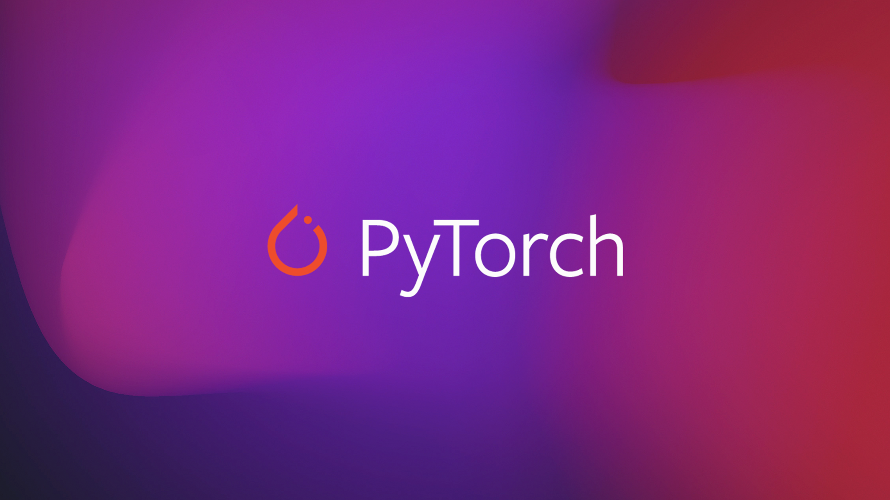

Insurance cost prediction using linear regression.

In this assignment we’re going to use information like a person’s age, sex, BMI, no. of children and smoking habit to predict the price of yearly medical bills. This kind of model is useful for insurance companies to determine the yearly insurance premium for a person. The dataset for this problem is taken from: https://www.kaggle.com/mirichoi0218/insurance
We will create a model with the following steps: 1. Download and explore the dataset 2. Prepare the dataset for training 3. Create a linear regression model 4. Train the model to fit the data 5. Make predictions using the trained model
This assignment builds upon the concepts from the first 2 lectures. It will help to review these Jupyter notebooks:
PyTorch basics: https://jovian.ml/aakashns/01-pytorch-basics
Linear Regression: https://jovian.ml/aakashns/02-linear-regression
Logistic Regression: https://jovian.ml/aakashns/03-logistic-regression
Linear regression (minimal): https://jovian.ml/aakashns/housing-linear-minimal
Logistic regression (minimal): https://jovian.ml/aakashns/mnist-logistic-minimal

<iframe src="https://jovian.ml/embed?url=https://jovian.ml/garimasingh128/02-insurance-linear-regression/v/3" title="Jovian Viewer" height="563" width="800" frameborder="0" scrolling="auto"></iframe>

> Let's Start! [Check out the original post on Medium.](https://medium.com/@garingh128/insurance-cost-prediction-using-linear-regression-5f35fbcb4768)
